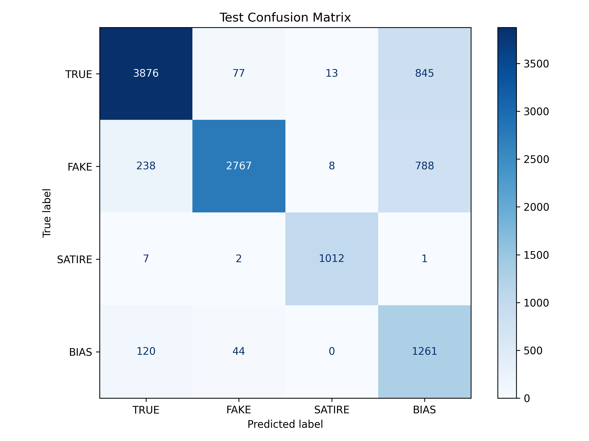
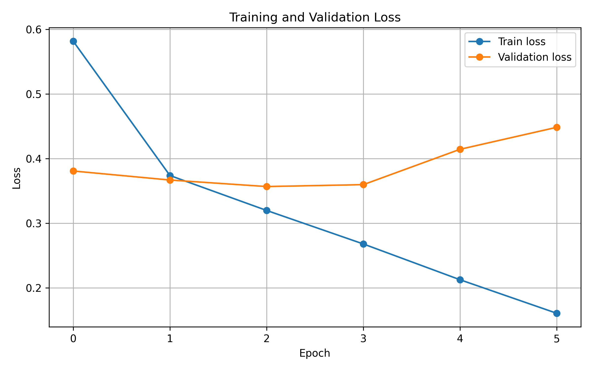

# Article Credibility 4-Class Classifier

Multi-class NLP classifier for article credibility assessment.

## Classes

- True
- Fake
- Satire
- Bias

## Model Architecture

The classifier consists of:

- Embedding layer
- Conv1D layer
- ReLU activation
- MaxPooling
- BiLSTM
- Dropout
- Fully Connected output layer

## Dataset

Dataset source:
```text
https://www.kaggle.com/datasets/aviseth20/multi-class-fake-news-dataset
```

Expected dataset location:

```text
dataset/Dataset_Clean.csv
```


Class mapping:

```text
0 = TRUE
1 = FAKE
2 = SATIRE
3 = BIAS
```

The preprocessing pipeline combines article title and content into a single input text.

## Installation

Create virtual environment:

```bash
python3 -m venv venv
source venv/bin/activate
```

Install dependencies:

```bash
pip install -r requirements.txt
```

## Training

Run training:

```bash
python3 train.py
```

The script:

- Loads and preprocesses the dataset
- Tokenizes text using XLM-RoBERTa tokenizer
- Splits data into train, validation and test sets
- Trains a CNN + BiLSTM classifier
- Saves the best checkpoint
- Logs metrics to Comet ML

## Example .env:

```text
COMET_API_KEY=your_api_key
```

## Prediction

Classify raw text:

```bash
python3 predict.py --text "Example article text"
```

Classify URL:

```bash
python3 predict.py --url "https://example.com/article"
```

Classify PDF:

```bash
python3 predict.py --pdf article.pdf
```

## Evaluation Metrics

The model is evaluated using:

- Accuracy
- Precision
- Recall
- F1-score
- Confusion Matrix
- Classification Report

## Example performance
Final Test Results

| Metric            | Value |
| ----------------- | ----- |
| Loss              | 0.36  |
| Accuracy          | 0.81  |
| Precision (Macro) | 0.82  |
| Recall (Macro)    | 0.85  |
| F1-score (Macro)  | 0.81  |

## Class-wise F1-score

| Class  | F1-score |
| ------ | -------- |
| TRUE   | 0.86     |
| FAKE   | 0.83     |
| SATIRE | 0.98     |
| BIAS   | 0.58     |


The model performs well on TRUE,FAKE, SATIRE classes, while the BIAS class remains the most challenging due to overlap with with factual and misleading content.
### Confusion Matrix



### Training and Validation Loss



## Experiment Tracking

Experiments were tracked with Comet ML.

Comet ML dashboard:
https://www.comet.com/hasakij/fake-news/view/new/panels

## Requirements

Main libraries:

- torch
- transformers
- pandas
- numpy
- scikit-learn
- spacy
- trafilatura
- pdfplumber
- comet_ml

## Git Ignore

The repository ignores:

```text
.env
archive/
best_model.pt
dataset/
__pycache__/
*.pyc
*_metrics.py
test.py
```
